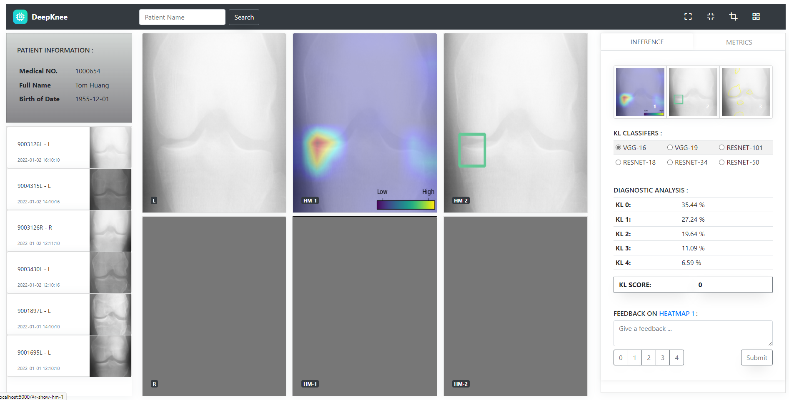
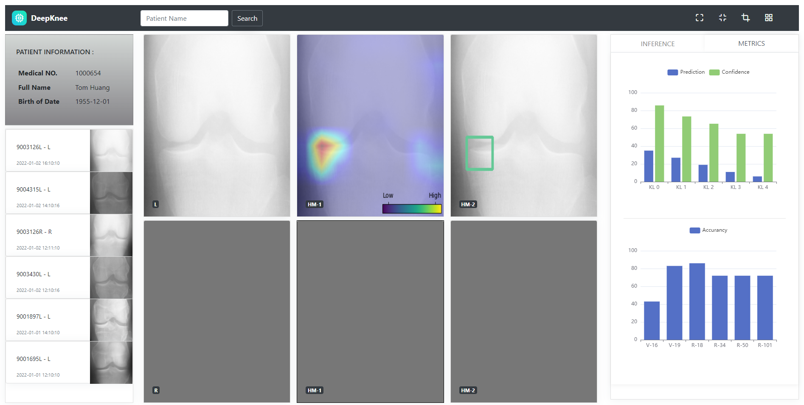

## University of Amsterdam AI / XAI project for Medical Organization - Quin
- conda create --name DeepKnee python=3.8.8
- conda activate DeepKnee
- git clone https://github.com/whu-linuxer/UVA21_DSP_QUIN.git
- cd UVA21_DSP_QUIN
- pip install -r requirements.txt
- python run.py

Group Members: Lukas, Jordy, Anna and Wenhua

Contact: w.hu1224@gmail.com (Wenhua Hu)

GUI Functionalities:

- support to search for patient from system - Here we use the local lightweighted database sqllites
- support to update patient personal information and radiographs data, the latest radiographs are ahead of the other radiographs (clinician can focus on the new radiographs being received)
- support to do prediction and explainable analysis in parallel
- support to zoom in the radiographs
- provide thumbnails to hint the progress of processing (HEATMAP, BOUNDINGBOX AND LIME)
- support to choose 6 kinds of single models
- support to switch among radiographs for comparison
- provide different channels for both left and right knees 
- support to give confidence score for 5 grades
- support to give a feedback / decison on top of a specific XAI image (Clicking on the thumbnail to switch the corresponding comment box, Quin could evaluate or improve the model on top of these data)
- support to show the metrics on top of each model being selected (the question mark can show the desc on hovering)

Notes: the Lime needs some minutes to analysis

Inference:

Metrics:

