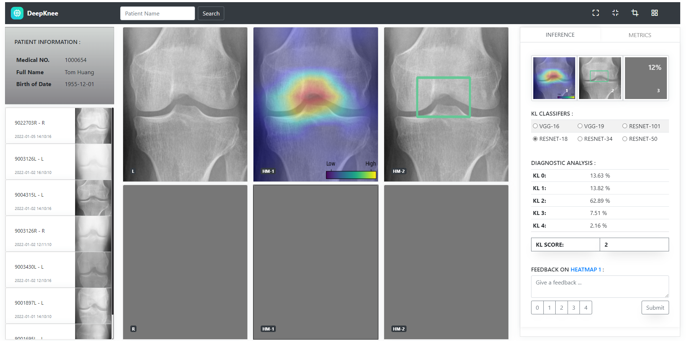

## University of Amsterdam AI / XAI project for Medical Organization - Quin
- conda create --name DeepKnee python=3.8
- conda activate DeepKnee
- git clone https://github.com/whu-linuxer/UVA21_DSP_QUIN.git
- cd UVA21_DSP_QUIN
- pip install -r requirements.txt
- python run.py

Group Members: Lukas, Jordy, Anna and Wenhua

Contact: w.hu1224@gmail.com (Wenhua Hu)

GUI Functionalities:

- support to search for patient by inputing name from database
- support to show patient personal information
- support to show patient's xray images and  latest taken images show top of past images
- support to click on images to do prediction and analysis
- support to zoom in the images by clicking on the images in the content
- support to display thumbnails of all XAI images (HEATMAP, BOUNDINGBOX AND LIME)
- support to predict with single model of 6 models
- support to switch among the XAI images in content by clicking on the specific thumbnail
- support to recognize the which side of the knee (LEFT or RIGHT)
- support to do analysis for both 2 knees in parallel 
- support to predict the label and show confidence score in 5 grades 
- support to give the feedback on specific XAI images (Clicking on the thumbnail to switch the corresponding feedback box)
- support to give the user's decision (the administration on Quin can evaluate or improve the model on top of these data)
- support to show the metrics on top of each model being selected (the question mark can show the desc on hovering)

Notes: the Lime needs some minutes to analysis (the progress on percentage gives a hint when it is done)

Inference:

Metrics:

