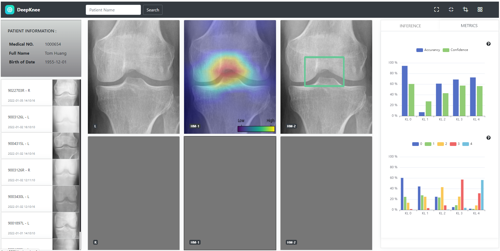

## UvA - QUIN DeepKnee Project

Steps:

- conda create --name DeepKnee python=3.8
- conda activate DeepKnee
- git clone https://github.com/whu-linuxer/UVA21_DSP_QUIN.git
- cd UVA21_DSP_QUIN
- pip install -r requirements.txt
- python run.py

Group Members: Lukas, Jordy, Anna and Wenhua

Contact: w.hu1224@gmail.com (Wenhua Hu)

Inference:

Metrics:

